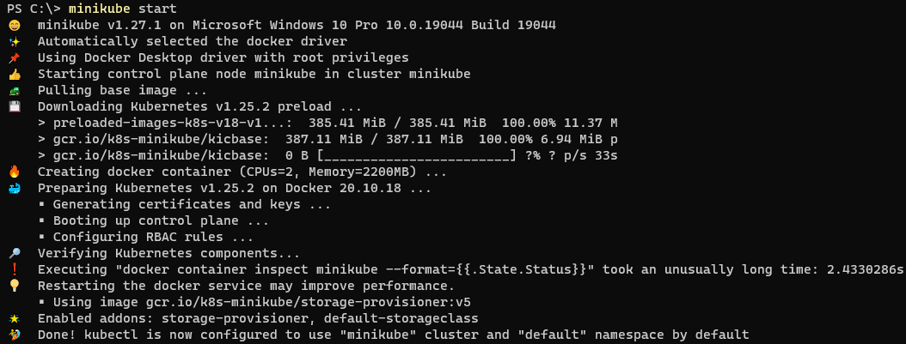

University: [ITMO University](https://itmo.ru/ru/)
Faculty: [FICT](https://fict.itmo.ru)
Course: [Introduction to distributed technologies](https://github.com/itmo-ict-faculty/introduction-to-distributed-technologies)
Year: 2022/2023
Group: K4112c
Author: Shikhov Roman Alekseevich
Lab: Lab1
Date of create: 24.10.2022
Date of finished: dd.mm.2022

- minikube start
Разворачивает кластер \

- kubectl version
Проверяем, что развертывание произошло успешно, и сервер kubernetes доступен \

- kubectl create -f .\pod-manifest.yaml
Создает объекты (1 под и 1 сервис в данном случае) согласно конфигурации, содержащейся в файле .\pod-manifest.yaml
В данном случае эквивалентно выполнению команд:
kubectl run my-vault --image vault --port 8200
kubectl expose pod/my-vault --port 8200 --type NodePort \

Убедиться в том, что pod и соответствующий сервис были созданы, можно вызвав команду 'kubectl get all'.
Там же описаны состояния pod'ов. \

- kubectl port-forward service/my-vault 8200:8200
Перенаправляет трафик, приходящий на порт 8200 физ машины на порт 8200 pod'a, для которого был создан сервис service/my-vault. \

Теперь можно отправлять запросы к приложению, используя адрес 'http://localhost:8200'. \

- kubectl logs pod/my-vault
Выводит логи одного контейнера, принадлежащего pod'у my-vault.
Если у pod'a больше, чем 1 контейнер, то необходимо указать опцию --all-container=true, чтобы вывести логи со всех контейнеров. \

* Необходимый токен находится в конце логов, в поле с название 'Root Token'.

Вставив значение root token'a и авторизовавшись, попадаем на следующую страницу. \

После выполнения всех этапов работы, остановим кластер командой 'minikube stop'. \

