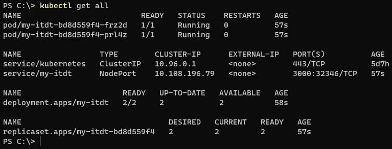

University: [ITMO University](https://itmo.ru/ru/) \
Faculty: [FICT](https://fict.itmo.ru) \
Course: [Introduction to distributed technologies](https://github.com/itmo-ict-faculty/introduction-to-distributed-technologies) \
Year: 2022/2023 \
Group: K4112c \
Author: Shikhov Roman Alekseevich \
Lab: Lab2 \
Date of create: 31.10.2022 \
Date of finished: dd.mm.2022

- minikube start
- kubectl apply -f manifest.yaml \
Создаются deployment и nodeport service. \

В контейнеры передаются следующие переменные окружения: \
REACT_APP_USERNAME: hrenaki \
REACT_APP_COMPANY_NAME: itmo

- Посмотрим список объектов: \

- Посмотрим, что переменные окружения установились:
  - kubectl describe pod/my-itdt-bd8d559f4-frz2d \

  - kubectl describe pod/my-itdt-bd8d559f4-prl4z \

- kubectl port-forward service/my-itdt 3000:3000 \

- Откроем браузер и зайдем на сайт по ссылке: http://localhost:3000 \

Наблюдаем те же самые переменные окружения и их значения, которые установили ранее. \
При многократном обновлении страницы адрес pod'а не меняется.

- kubectl logs pod/my-itdt-bd8d559f4-frz2d \

- kubectl logs pod/my-itdt-bd8d559f4-prl4z \

- Схема организации объектов: \
