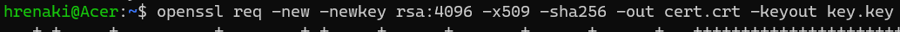

University: [ITMO University](https://itmo.ru/ru/) \
Faculty: [FICT](https://fict.itmo.ru) \
Course: [Introduction to distributed technologies](https://github.com/itmo-ict-faculty/introduction-to-distributed-technologies) \
Year: 2022/2023 \
Group: K4112c \
Author: Shikhov Roman Alekseevich \
Lab: Lab3 \
Date of create: 01.11.2022 \
Date of finished: dd.mm.2022

- Создаем манифест, содержащий указанный configMap, deployment, исплользующий значения из configMap, и сервис NodePort, открывающий доступ к pod'a deployment'a. \
Значения переменных в configMap
react_app_username: hrenaki \
react_app_company_name: itmo \

- Создаем объекты k8s командой 'kubectl apply -f manifest_lab3.yaml' \

- Посмотрим информацию в configMap:\

- Генерируем самоподписанный сертификат и приватный ключ:\

- Расшифруем сгенерированный приватный ключ:\

- Включаем аддон 'ingress':\

- По созданному сертификату и приватному ключу создаем tls секрет:\

- Создаем ingress с помощью манифеста 'ingress-manifest.yaml':\

- Т.к. minikube запущен на Windows, то для доступа к ingress, необходимо создать minikube tunnel. Тогда ingress станет доступен по адресу 127.0.0.1. Именно этот адрес нужно добавить в hosts, находящийся в 'C:\Windows\System32\drivers\etc'\
Добавленная строка в файл 'hosts':\

- minikube tunnel\

- Перейдем на сайт по FQDN 'my-itdt.hrenaki':\

- Откроем сведения о сертификате:\

- Браузер 'ругается' на созданный сертификат, т.к. он является самоподписанным. Иерархия сертификатов следующая:\

- Схема организации объектов k8s:\
