University: [ITMO University](https://itmo.ru/ru/) \
Faculty: [FICT](https://fict.itmo.ru) \
Course: [Introduction to distributed technologies](https://github.com/itmo-ict-faculty/introduction-to-distributed-technologies) \
Year: 2022/2023 \
Group: K4112c \
Author: Shikhov Roman Alekseevich \
Lab: Lab4 \
Date of create: 05.11.2022 \
Date of finished: 19.11.2022

- Создаем кластер с 2мя нодами и плагином CNI = calico:\
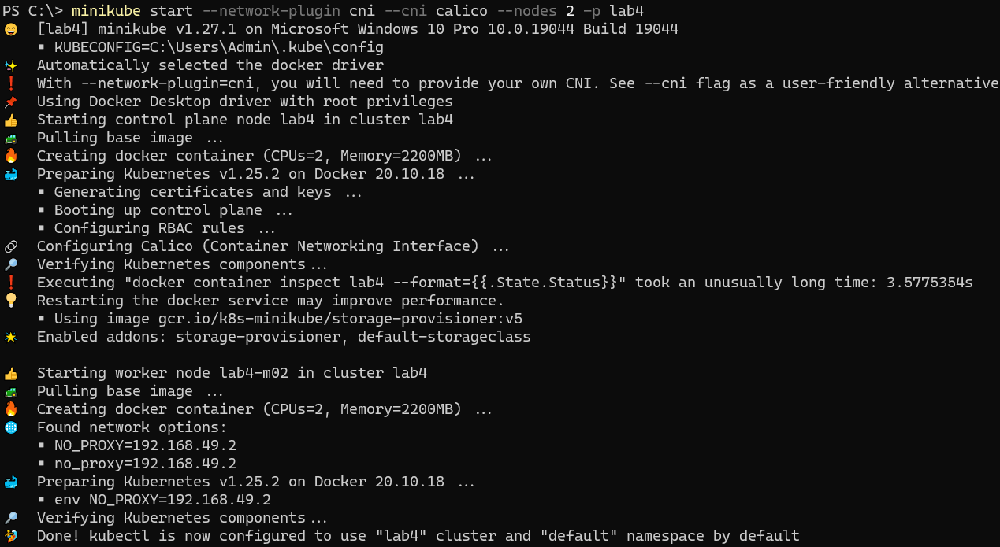

- Проверяем, что pod'ы calico запустились:\
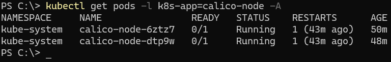

- Смотрим k8s nod'ы:\
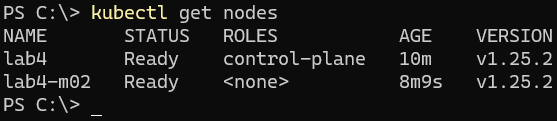

- Удаляем default ippool и создаем кастомные:\
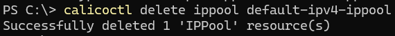
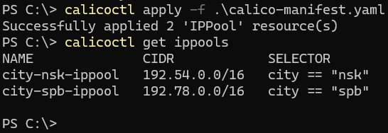

- Помечаем соответствующими метаки ноды:\
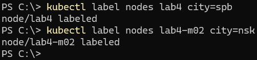

- Создаем deployment и service NodePort:\
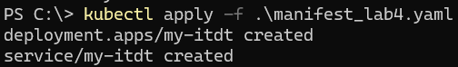

- Проверяем IP адреса созданных pod'ов deployment'а:\
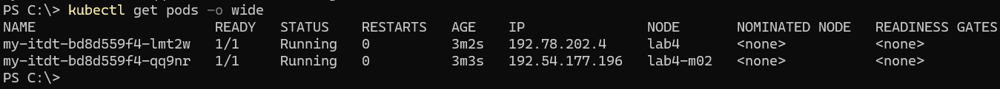

- Делаем port-forward на созданный сервис:\
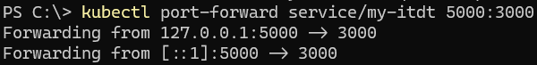

- Заходим на сайт по url: http://localhost:5000 :\
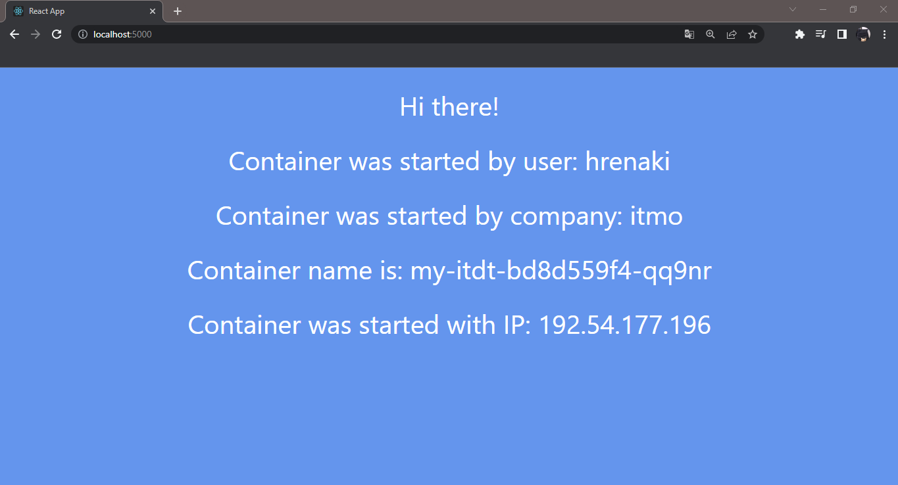

- Заходим в pod и делаем ping другого по его IP:\
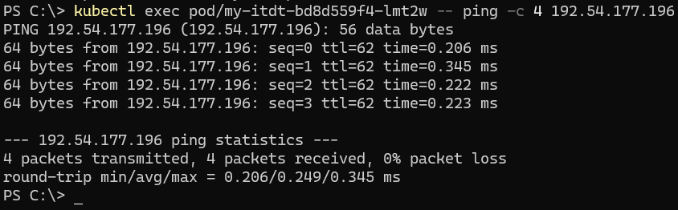

- Схема организации объектов:\
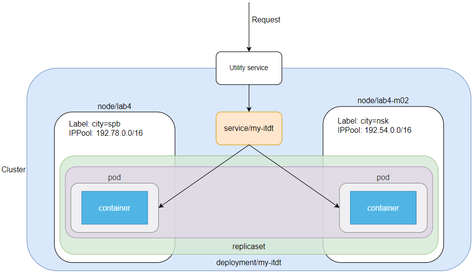
